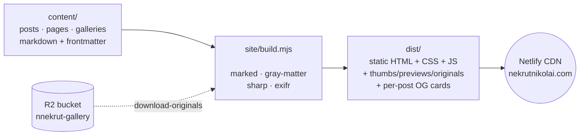
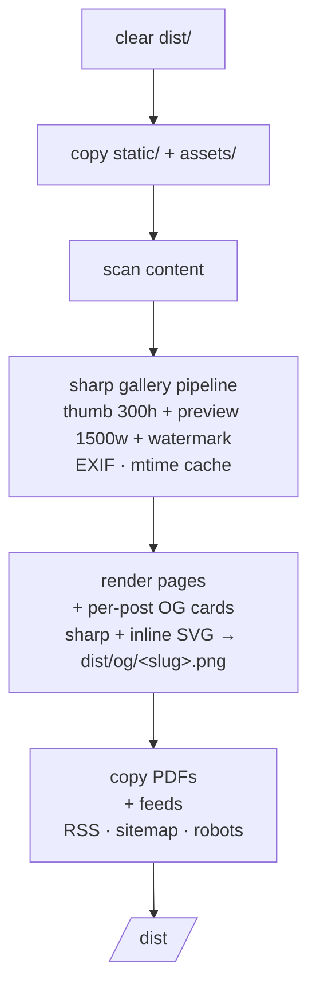
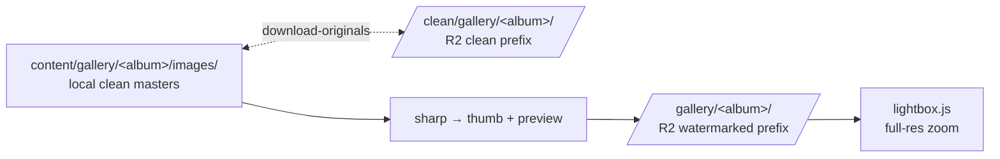
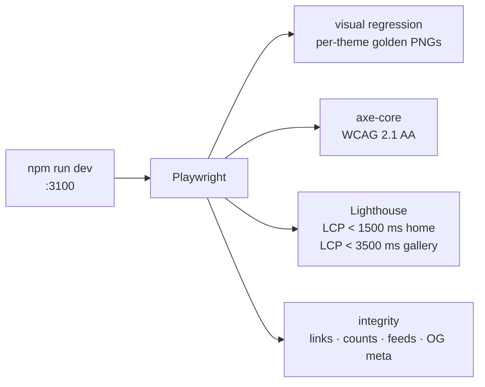

# [mysite](https://nekrutnikolai.com/)

[](https://app.netlify.com/projects/nnekrut/deploys)

My personal site. Pure HTML/CSS emitted by a small Node build, zero framework, deployed to Netlify. Three themes (light, dark, parchment).

## Quick start

```bash
git clone https://github.com/nekrutnikolai/mysite && cd mysite
npm install
npm run download-originals          # gallery masters from R2 (needs .env)
npm run dev                         # http://localhost:3100
```

`npm run build` writes `dist/`. `npm run test` runs the Playwright suite (first time only: `npx playwright install chromium`). Cold local build: ~10 s. Incremental: ~350 ms.

## How it works



Push to `master` → Netlify runs `npm ci && npm run download-originals && npm run build` → publishes `dist/`. Every page is a real `index.html` on disk.

## Project layout

```
site/
  build.mjs           orchestrator
  serve.mjs           dev server (chokidar + SSE live-reload)
  lib/                content, templates, shortcodes, sharp pipeline, OG cards, feeds
  templates/          one .html per page kind (mustache-lite)
  partials/           head, header, footer, breadcrumbs, toc, scripts
  assets/css/         tokens · themes · layout · components · gallery · resume · nav
  assets/js/          theme.js · nav.js · lightbox.js
  scripts/            R2 sync + local Resume.pdf generator
  cache/images.json   sharp mtime+size manifest (gitignored)

content/              source markdown + Resume.pdf, Portfolio.pdf
static/               files copied verbatim into dist/ (favicons, OG images)
tests/                Playwright: integrity · visual · a11y · perf
dist/                 build output (gitignored)
```

## Build pipeline



## Adding a gallery

When you have a fresh batch of JPEGs (e.g. from Photos.app):

```bash
npm run new-gallery -- ~/Pictures/maine-trip
# scaffolds content/gallery/maine-trip/{index.md, images/}
# pre-fills frontmatter: title, date, draft: true, location (lat,lng from GPS), dateRange

# edit index.md (friendlier location, description, flip draft: false)
npm run dev                       # preview at /gallery/maine-trip/
npm run upload-originals          # push to R2
git add content/gallery/maine-trip/index.md && git commit -m "add maine-trip gallery"
git push
```

Flags: `--name <slug>`, `--title "..."`, `--date <iso>`, `--replace`. HEIC is refused — re-export as JPEG. Filenames are preserved verbatim. 24MP source files work fine; expect proportional sharp/R2-upload time.

## Resume PDF

`Resume.pdf` is regenerated from the live `/resume/` HTML — but **runs locally**, not on the build server, so Netlify doesn't need a chromium binary:

```bash
npm run build:pdf          # build + regen content/Resume.pdf
git add content/Resume.pdf && git commit -m "update resume PDF"
```

Netlify just copies the committed `content/Resume.pdf` into `dist/` like any other PDF.

## Gallery storage

Source images live in a Cloudflare R2 bucket (`nnekrut-gallery`), not git. Two prefixes:



`clean/` = pristine masters for sharp regeneration. `gallery/` = watermarked + EXIF-tagged versions the public lightbox loads. `npm run upload-originals` pushes both directions after a `BUILD_ORIGINALS=1` build.

## Tests



`npm run test` for the full suite. `npm run test:update` re-seeds visual snapshots after intentional CSS changes.

## Commands

| Command | What it does |
|---|---|
| `npm run dev` | Dev server on `:3100` with watch + reload |
| `npm run dev:drafts` | Same as `dev` but surfaces `draft: true` content for preview |
| `npm run build` | One-shot build into `dist/` |
| `npm run build:pdf` | Regenerate `content/Resume.pdf` (local-only) |
| `npm run new-gallery -- <folder>` | Scaffold a gallery from a folder of JPEGs |
| `npm run download-originals` | Pull gallery masters from R2 |
| `npm run upload-originals` | Push clean + watermarked galleries to R2 |
| `npm run test` | Full Playwright suite |
| `npm run test:update` | Re-seed visual snapshots |
| `npm run report` | Open Playwright HTML report |

See [CLAUDE.md](./CLAUDE.md) for architecture, gotchas, and design decisions.

## Future work

### Content & discovery
1. **Syntax highlighting** — code blocks are plain `<pre><code>` with no language coloring. Shiki or highlight.js as a marked extension.
2. **Full-text static search** — no in-page search today. Pagefind or lunr.js index at build time.
3. **Related posts** — no cross-linking. Tag-overlap scoring could surface 2–3 related posts per page.
4. **Post excerpts in archives** — `/posts/` shows title + date only. First paragraph or `<!--more-->` marker would improve scanability.

### Performance
5. **HTML/CSS/JS minification** — all assets ship uncompressed.
6. **WebP/AVIF generation** — sharp already processes every gallery image; `<picture>` fallback is low-effort.
7. **Responsive images with srcset** — gallery previews are single-size (1500 w).
8. **Incremental content builds** — re-renders all posts on every change. Mtime-gating like the image cache would speed up dev iteration.

### Accessibility
9. **`prefers-reduced-motion` support** — no media queries respect it today.
10. **Skip-to-main link** — no keyboard shortcut to bypass the header.

### Gallery
11. **Slideshow / auto-advance mode** — lightbox is manual-navigation only.

### OG cards
12. **Bundle Source Serif 4 + IBM Plex Mono** — current cards fall back to system fonts (DejaVu Serif on Linux, Georgia on macOS) for portability. Bundling TTFs would give pixel-identical typography.
