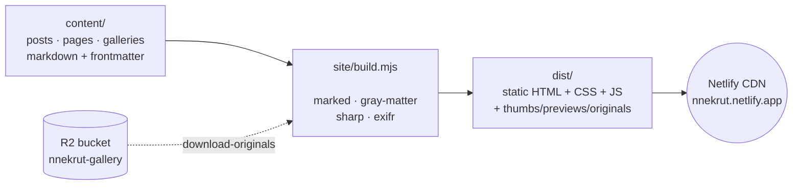
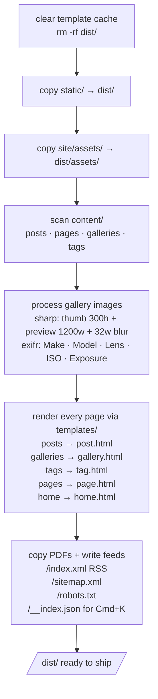
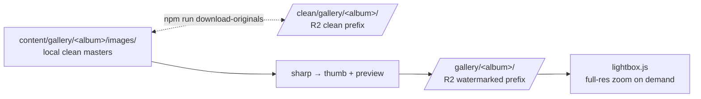
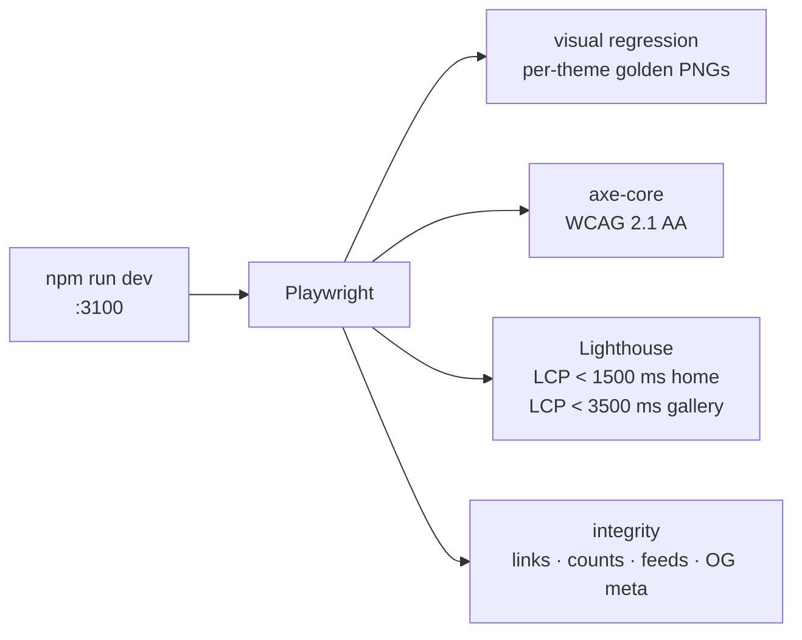

# [mysite](https://nnekrut.netlify.app/)

[](https://app.netlify.com/projects/nnekrut/deploys)

My personal site. Pure HTML/CSS emitted by a ~700-LOC Node build (`site/build.mjs`), zero framework, deployed to Netlify. Three themes (light, dark, parchment) with localStorage persistence.

## Quick start

```bash
git clone https://github.com/nekrutnikolai/mysite && cd mysite
npm install
npx playwright install chromium    # first time only
npm run download-originals          # pull gallery masters from R2 (needs .env)
npm run dev                         # http://localhost:3100
```

`npm run build` writes `dist/`. `npm run test` runs the Playwright suite.

No `.env`? You can still develop — the build skips the gallery image pipeline and pages render with broken `` tags. R2 credentials go in `.env`; see `.env.example`.

## How it works



Push to `master` → Netlify runs `npm ci && npm run download-originals && npm run build` → publishes `dist/`. No SSR, no hydration, no API. Every page is a real `index.html` on disk.

## Project layout

```
site/
  build.mjs           orchestrator: scan → render → write
  serve.mjs           dev server with chokidar + SSE live-reload
  lib/
    content.mjs       walk content/ → typed records (post|page|gallery|tag)
    template.mjs      mustache-lite renderer ({{var}} / {{#sec}} / {{>partial}})
    shortcodes.mjs    Hugo-shortcode pre-pass (figure, youtube, gallery, mkdowntable)
    images.mjs        sharp pipeline + EXIF + mtime cache
    routes.mjs        Hugo-compatible slugify
    feeds.mjs         RSS 2.0 + sitemap XML
    contentIndex.mjs  flat JSON index for the Cmd+K palette
    escape.mjs        4 named escape functions (template/feed/shortcode/svg)
    walk.mjs          one shared recursive directory walker
  templates/          one .html per page kind (mustache)
  partials/           head, header, footer, scripts, cmdk, breadcrumbs, toc, …
  assets/css/         tokens · themes · layout · components · gallery · resume · nav
  assets/js/          theme.js (35 LOC) · nav.js (663 LOC) · lightbox.js (554 LOC)
  cache/images.json   mtime+size keyed manifest (gitignored)

content/              source markdown — posts, pages, galleries
static/               files copied verbatim into dist/ (favicons, OG images, PDFs)
tests/                Playwright: integrity · visual · a11y · perf
docs/                 design specs and execution plans
dist/                 build output (gitignored)
```

## Build pipeline



Cold build is ~75 s for 146 gallery images at 3 sizes each. Subsequent rebuilds with the mtime cache are sub-second. Dev mode (`npm run dev`) re-runs the same build on every save and pushes an SSE `event: reload` to connected browsers.

## Gallery storage

Source images don't live in git — they're in a Cloudflare R2 bucket (`nnekrut-gallery`) with two prefixes:



- `clean/` — pristine masters; what `sharp` reads to regenerate thumbnails and previews.
- `gallery/` — watermarked + EXIF-tagged versions; what the public lightbox loads as `data-full` for full-resolution zoom.
- `npm run upload-originals` does the reverse: clean from `content/`, watermarked from `dist/`, after a `BUILD_ORIGINALS=1` build.

## Themes

Three themes via `data-theme` attribute on `<html>` with localStorage persistence. Light is `:root`; dark and parchment are overrides in `themes.css`. The toggle in the header cycles `light → dark → parchment → light`. A small inline script in `partials/head.html` restores the theme synchronously before first paint to prevent FOUC.

All semantic colors meet WCAG 2.1 AA contrast for body text.

## Tests



Run `npm run test` for the full suite, or `npm run test:visual` / `:a11y` / `:perf` / `:integrity` for one discipline. After intentional CSS changes, `npm run test:update` re-seeds visual snapshots.

## Commands

| Command | What it does |
|---|---|
| `npm run dev` | Dev server on `:3100` with chokidar watch + SSE reload |
| `npm run build` | One-shot build into `dist/` |
| `npm run download-originals` | Pull gallery masters from R2 |
| `npm run upload-originals` | Push clean + watermarked galleries to R2 |
| `npm run test` | Full Playwright suite |
| `npm run test:update` | Re-seed visual snapshots after intentional CSS changes |
| `npm run report` | Open the Playwright HTML report after a failed run |

See [CLAUDE.md](./CLAUDE.md) for the full architecture writeup, gotchas, and design decisions.
